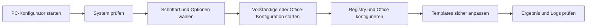

# PC-Konfigurator

Komplette portable Anwendung für Windows-PC-Konfiguration.

**Version:** 3.3.20 (Build: 20.06.2026, Python 3.13.7)

## Übersicht

Dies ist der PC-Konfigurator als portable Windows-Anwendung mit erweiterter
Windows-Systemkonfiguration, sicherer Template-Verarbeitung und dynamischer
Schriftfamilien-Auswahl aus dem Ordner `data/Fonts`.

Die Anwendung konfiguriert automatisch Office-Programme, Windows-Einstellungen,
Office-Vorlagen und benutzerspezifische Schriftarten.

## Ablauf auf einen Blick




_Mermaid-Quelle: `docs/diagramme/anwender_ablauf.mmd`_

## Hauptfunktionen

### Template-Verarbeitung

- Korruptionsfreie Verarbeitung aller drei Template-Typen:
  - `Normal.dotm` (Word-Standardvorlage)
  - `Mappe.xltx` (Excel-Arbeitsmappe)
  - `NormalEmail.dotm` (Outlook-E-Mail-Vorlage)
- `SafeTemplateProcessor` mit ZIP-Integritätsprüfung
- Backup-&-Restore-Mechanismus
- Automatische Font-Anpassung ohne Template-Beschädigung

### Windows-System

- Taskleiste linksbündig ausrichten (Windows 11)
- Klassisches Kontextmenü aktivieren
- Taskleisten-Widgets ausblenden
- Suchfeld in der Taskleiste ausblenden
- Beim App-Start wird der gewünschte Startmenü-Modus automatisch gesetzt (Windows 11 oder optional klassisch als dauerhafter Fallback; Benutzerkontext, ohne Adminrechte)
- Zusätzlich wird eine externe Benutzer-Autostart-Variante hinterlegt (`%APPDATA%\\PC-Konfigurator\\startmenu-guard` + Eintrag im Startup-Ordner), damit der gewählte Modus auch ohne manuellen App-Start bei Anmeldung angewendet wird

### Office-Konfiguration

- Word, Excel und Outlook automatisch konfigurieren
- Template-Management aus `data/Datei-Vorlagen/Sonstiges/Standards`
- Standard-Schriftarten sicher setzen
- Entwicklertools und Benutzeroberfläche optimieren
- Zentrale Word-Autokorrektur-Optionen per Registry deaktivieren:
  - Zwei Großbuchstaben am Wortanfang korrigieren
  - Jeden Satz mit einem Großbuchstaben beginnen
  - Automatische Aufzählung
  - Automatische Nummerierung
  - Ersten Buchstaben groß schreiben

### Schriftart-Management

- Font-Familien werden dynamisch aus dem Ordner `data/Fonts` erkannt
- Die gewählte Familie wird ins Benutzerprofil installiert
- Die gewählte Familie wird anschließend Templates und Office-Einstellungen zugeordnet
- Windows Font API und Benutzer-Registry werden genutzt

## Projektstruktur

```text
PC-Konfigurator-v3.3.1/
├── PC-Konfigurator.exe
├── README.md
├── BUILD-INFO.txt
├── docs/
│   ├── README.md
│   ├── DOKUMENTATION_ANWENDER.md
│   ├── DOKUMENTATION_TECHNIK.md
│   └── DOKUMENTATION_CHECKLISTE.md
├── data/
│   ├── Datei-Vorlagen/
│   │   └── Sonstiges/Standards/
│   │       ├── Normal.dotm
│   │       ├── Mappe.xltx
│   │       └── NormalEmail.dotm
│   └── Fonts/
│       ├── Aptos/
│       ├── Futura/
│       ├── Montserrat/
│       └── ...
└── logs/          # wird bei Bedarf erstellt
```

## Template-Verarbeitung im Detail

### SafeTemplateProcessor

- ZIP-basierte sichere Template-Bearbeitung
- Automatische Backup-Erstellung vor Modifikation
- XML-Namespace-bewusste Font-Einstellungen
- Integritätsprüfung mit Rollback bei Beschädigung
- Unterstützung für Word- und Excel-Templates

### Deployment-Ziele

- `Normal.dotm` → `%APPDATA%\Microsoft\Templates\`
- `Mappe.xltx` → `%APPDATA%\Microsoft\Excel\XLSTART\`
- `NormalEmail.dotm` → `%APPDATA%\Microsoft\Templates\`

## Installation und Verwendung

### Schnellstart

1. Keine Installation erforderlich.
2. Doppelklick auf `PC-Konfigurator.exe`.
3. Gewünschte Schriftfamilie auswählen.
4. `Vollständige Konfiguration starten` für die komplette Einrichtung wählen.
5. Templates werden automatisch sicher angepasst und kopiert.

### Entwicklung und Build-System

```bash
# Python-Umgebung einrichten
.\setup.ps1

# Anwendung aus Source ausführen
python src/main.py

# Neues Build erstellen
.\build.ps1 -NoVersionBump
```

Der Build-Prozess ergänzt automatisch:

- Fonts
- Templates
- Dokumentation
- Hidden-Attribute für `logs`

## Technische Details

### Sicherheit und Template-Schutz

- ZIP-Integritätsprüfung vor Template-Bearbeitung
- Automatische Backup-Erstellung mit Rollback
- XML-sichere Modifikationen mit Namespace-Unterstützung
- Nur `HKEY_CURRENT_USER` wird geändert
- Vollständiges Logging aller Template- und Registry-Operationen

### Kompatibilität

- Windows 10 und Windows 11
- Office 2013, 2016, 2019, 2021 und Microsoft 365
- Outlook-E-Mail-Templates (`NormalEmail.dotm`)
- Funktioniert auch ohne Office-Installation für Windows-/Font-Teile

### Aktuelle Statistiken

- 3 Template-Typen vollständig unterstützt
- 15 dynamisch erkannte Font-Familien im aktuellen Bestand `data/Fonts`
- 55 Schriftart-Dateien im Build
- 173 Vorlagen-Dateien im Build

### Template-Verarbeitungszeiten

- `Normal.dotm`: Styles- und Theme-Anpassung
- `Mappe.xltx`: Font-Definitionen in `styles.xml`
- `NormalEmail.dotm`: Outlook-spezifische Formatierung
- Verarbeitungszeit typischerweise ca. 2 bis 5 Sekunden pro Template

## Changelog

### v3.3.19 (20. Juni 2026)

- **Explorer-Neustart robustifiziert:** Neustart wartet jetzt auf sichtbare Taskleiste (`Shell_TrayWnd`) statt nur auf einen laufenden `explorer.exe`-Prozess.
- **Shell-Recovery-Fallback ergänzt:** Bei verzögertem Shell-Rebind werden zusätzliche Recovery-Schritte ausgeführt (u. a. Re-Init von Shell-Komponenten und `userinit.exe`-Fallback).
- **Outlook-Template-Auflösung gehärtet:** Quellpfad für `NormalEmail.dotm` funktioniert jetzt auch in Direkt-/Script-Läufen ohne Bundle-Kontext.
- **Office-UI-Transparenz verbessert:** GUI zeigt konsistente Hinweise zu `Word/Outlook` und zur bekannten Einschränkung der modernen Outlook-Compose-Oberfläche.

### v3.3.7 (17. Juni 2026)

### v3.3.8 (17. Juni 2026)

- Externer Startmenü-Autostart im Benutzerprofil hinterlegt:
  `%APPDATA%\PC-Konfigurator\startmenu-guard` + Eintrag im Startup-Ordner.
- Damit wird der gewählte Startmenü-Modus auch ohne manuellen App-Start
  bei jeder Windows-Anmeldung automatisch angewendet.

### v3.3.9 (18. Juni 2026)

- **Bugfix `startmenu_guard.py`:** SyntaxError beim Modulimport behoben (GUID in
  f-String war nicht korrekt escaped → `invalid decimal literal`). Kontextmenü-
  klassisch/modern-Wechsel und Autostart-Hinterlegung sind jetzt funktionsfähig.
- **Bugfix `main.py`:** App-Start killt nicht mehr den Windows-Explorer. Der
  Startmenü-Guard schreibt den Modus beim Kaltstart still in die Registry
  (`auto_restart_explorer=False`); der Explorer wird nur noch bei manuellem
  Modus-Wechsel über die GUI neu gestartet.

- Startmenü-Guard erweitert: Modus ist nun in der GUI dauerhaft zwischen `🟦 Windows 11 (empfohlen)` und `🟧 Klassisch (Fallback)` umschaltbar.
- Start-Tab zeigt den aktiven Startmenü-Modus inklusive Live-Aktualisierung und Farbcodierung.
- Tab-Darstellung stabilisiert: problematische manuelle Tab-Skalierung entfernt (Hauptfenster + Registry-Detailfenster), Beschriftungen bleiben lesbar.
- Fensterhöhe dezent erhöht, damit Einstellungen im Bereich `Vorlagen/Ablage` (u. a. Schriftgrößen) zuverlässig sichtbar sind.

### v3.3.6 (08. Juni 2026)

- Office-Konfiguration robuster: Registry + COM-Synchronisierung für Word, Excel und Outlook.
- Word-Kompatibilitätskeys ergänzt (u. a. für buildabhängige UI-Zuordnungen).
- COM-Health vereinheitlicht in Log und Live-Status (`[COM-HEALTH] OK|DEGRADED`, Präfix `COM:`).
- Registry-Prüfung erweitert (Kontext mit User/SID/Elevation sowie Outlook-/Kompatibilitätskeys).

### v3.2.5 (28. April 2026)

- Registry-UX deutlich verbessert (übersichtlichere Darstellung, Erklärungen)
- Word-Startverhalten wiederhergestellt (Dokument beim Start nicht automatisch öffnen)
- `src/publish_release.ps1` für automatisiertes Release-Packaging hinzugefügt
- `SafeTemplateProcessor` erweitert
- `office_configurator.py` überarbeitet
- Build-Skript (`build.ps1`) verbessert

### v3.0.0 (26. April 2026)

- Dynamische Font-Familien-Auswahl aus dem Ordner `data/Fonts`
- Gewählte Font-Familie wird gezielt ins Benutzerprofil installiert
- Zuordnung der gewählten Familie zu Templates und Office-Konfiguration verbessert
- EXE- und Fenster-Icon korrigiert
- Release-ZIP enthält `_internal` und `logs` zuverlässig
- ZIP-Struktur vereinfacht
- Release-ZIP-Artefakte werden nicht mehr in Git versioniert

### v2.6.9 (26. April 2026)

- Build- und Packaging-Verbesserungen
- Portable Release mit Hidden-Verzeichnissen

### Frühere Versionen

- `v2.5.1`: Template-Revolution mit sicherer ZIP-Manipulation
- `v2.5.0`: Template-Fixes für `NormalEmail.dotm` und `Mappe.xltx`
- `v2.4.0`: große PowerShell-Implementierung

## Support

### Bei Problemen

1. Log-Dateien im Ordner `logs/` prüfen.
2. Windows-Ereignisanzeige kontrollieren.
3. Falls nötig als Administrator starten.

### Dokumentation

- `docs/README.md` – Dokumentations-Einstieg
- `docs/DOKUMENTATION_ANWENDER.md` – Detaillierte Benutzeranleitung
- `docs/DOKUMENTATION_TECHNIK.md` – Technische Dokumentation
- `docs/DOKUMENTATION_CHECKLISTE.md` – Doku-Qualitätscheckliste
- `docs/DOKUMENTATION_DIAGRAMME.md` – Mermaid-Quellen und SVG-Grafiken
- `docs/ANWENDERPRUEFUNG_CHECKLISTE.md` – Vollständige EXE-Testcheckliste
- `docs/ANWENDERPRUEFUNG_KURZCHECKLISTE.md` – 5–10-Minuten-Kurzcheck
- `docs/ANWENDERPRUEFUNG_AUSWERTUNG.md` – Auswertungsvorlage für Testfeedback
- `src/` – Vollständiger Source-Code
- Inline-Kommentare in den Modulen

## Markdown-Regel (verbindlich)

Für Markdown-Dateien gelten im Repository verbindlich:

- **MD012**: Keine mehrfachen Leerzeilen hintereinander.
- **MD022**: Vor und nach Überschriften eine Leerzeile.
- **MD032**: Vor und nach Listen eine Leerzeile.

Die Regeln sind in `.markdownlint.json` hinterlegt und bilden die Standardroutine
für die Beseitigung von MD-Fehlern bei Doku-Änderungen.

Prüfroutinen:

- Manuell: `tools/lint-markdown.ps1`
- Automatisch im Build: `build.ps1` (abschaltbar mit `-SkipMarkdownLint`)

---

Entwickelt: 28. April 2026 | Python 3.13.7 | CustomTkinter 5.2.2 | PyInstaller 6.17.0
Für Bildungseinrichtungen und professionelle Anwender optimiert.
