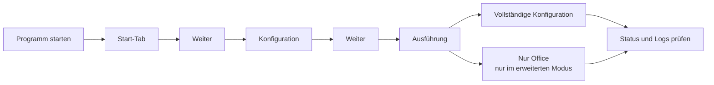

# DOKUMENTATION_ANWENDER

**Version:** 3.3.64 (12.09.2026)

> Diese Datei enthält den vollständigen Inhalt der früheren `ANLEITUNG.md` aus dem Projektroot.

## Schnellstart

Der `PC-Konfigurator` wird als portable Windows-Anwendung ausgeliefert und kann
ohne klassische Installation direkt gestartet werden.

## Ablauf auf einen Blick

_Mermaid-Quelle: `docs/diagramme/anwender_ablauf.mmd`_

### 1. Programm starten

- Doppelklick auf `PC-Konfigurator.exe`
- Die Anwendung öffnet sich mit moderner Oberfläche und mehreren Tabs

### 2. Konfiguration auswählen

**Tab „Konfiguration“:**

- Gewünschtes Ziel-Laufwerk wählen (z. B. `Z:` für BFW)
- Schriftart und Schriftgröße für Word/Excel festlegen
- Über **„Weiter“** unten zum Tab `Ausführung` wechseln
- Bedienmodus `Einfach`/`Erweitert` im Start-Tab wählen

### 3. Windows-Einstellungen

Im Bereich „Individuelle Einstellungen“ stehen zur Verfügung:

- **Taskleiste linksbündig ausrichten** (Windows 11)
- **Klassisches Kontextmenü aktivieren** (Windows 11)
- **Widgets in Taskleiste ausblenden**
- **Suchfeld in Taskleiste ausblenden**
- **Startmenü-Modus umschalten:** `Windows 11 (empfohlen)` oder `Klassisch (Fallback)`

Hinweis: Der gewählte Startmenü-Modus wird dauerhaft gespeichert und beim nächsten
Start still in die Registry geschrieben (Benutzerkontext, ohne Adminrechte). Der
Windows-Explorer wird dabei **nicht** neu gestartet — die Wirkung des gesetzten Modus
tritt beim nächsten Windows-Login automatisch über den Autostart-Guard in Kraft.
Wird der Modus manuell in der GUI umgeschaltet, startet der Explorer sofort neu,
damit die Änderung sofort sichtbar wird.

Falls die Taskleiste nach einem Explorer-Neustart nicht sofort erscheint, führt die
Anwendung automatisch zusätzliche Wiederherstellungsschritte aus. In seltenen Fällen
kann die Shell trotzdem noch einige Sekunden benötigen.

Zusätzlich hinterlegt die Anwendung eine externe Autostart-Variante im Benutzerprofil,
damit der Startmenü-Modus bei jeder Windows-Anmeldung automatisch angewendet wird:

- `%APPDATA%\\PC-Konfigurator\\startmenu-guard\\Ensure-StartmenuMode.ps1`
- `%APPDATA%\\PC-Konfigurator\\startmenu-guard\\Ensure-StartmenuMode.cmd`
- `%APPDATA%\\Microsoft\\Windows\\Start Menu\\Programs\\Startup\\PC-Konfigurator-StartmenuGuard.cmd`

### 3.1 Sichtbarkeit der Registerkarten

- Die Registerkarten im Hauptfenster und im separaten Registry-Detailfenster
  verwenden eine stabile Darstellung ohne aggressive Breiten-Skalierung.
- Dadurch bleiben die Tab-Beschriftungen auch bei kleineren Fensterbreiten
  zuverlässig lesbar.

### 4. Ausführung

**Tab „Ausführung“:**

- **Vollständige Konfiguration starten** – führt alle Anpassungen und Kopiervorgänge automatisiert aus
- **Nur Office konfigurieren** – nur im **erweiterten Modus**, schnelle Registry-Optimierungen und Template-Handling nur für Office

## Features im Detail

### Registry- und System-Einstellungen

**Word-Optimierungen:**

- Entwicklertools in Multifunktionsleiste
- Lineal und Formatierungszeichen standardmäßig anzeigen
- Tabellenlinien immer sichtbar
- **Automatische Deaktivierung zentraler Autokorrektur-Optionen:**
  - Zwei Großbuchstaben am Wortanfang korrigieren
  - Jeden Satz mit einem Großbuchstaben beginnen
  - Automatische Aufzählung
  - Automatische Nummerierung
  - Ersten Buchstaben groß schreiben

**Aktueller Status:**

- Die Word-Optionen „Jede Tabellenzeile mit einem Großbuchstaben beginnen" und „Bilder einfügen" = „Mit Text in Zeile" sind im `PC-Konfigurator` inzwischen als Standardkonfiguration hinterlegt.
- Der praktische Nachweis auf einem echten Testclient wird weiterhin in `docs/OFFENE_OFFICE_PUNKTE.md` dokumentiert.

**Excel-Optimierungen:**

- Entwicklertools aktivieren
- Erweiterte Bearbeitungsleiste
- Gitternetzlinien anzeigen

**Windows-System:**

- Taskleiste links statt zentriert (Windows 11)
- Klassisches Kontextmenü (Windows 11)
- Taskleisten-Elemente und Suchfeld ausblenden
- Explorer-Suche auf „Immer Dateinamen und -inhalte suchen" setzen (pro Benutzer)
- Empfohlene Dateien im Startmenü, zuletzt verwendete Dateien im Datei-Explorer und Sprunglisten standardmäßig deaktivieren
- Anwendungen im Startmenü standardmäßig als Liste anzeigen

**Outlook-Hinweis (modernes Outlook):**

- Die klassische Outlook-Engine übernimmt Standardfonts aus Registry/Template i. d. R. zuverlässig.
- In der modernen Outlook-Compose-Oberfläche kann Microsoft diese Vorgaben teilweise durch eigene UI-Standards übersteuern.
- Die Anwendung blendet dazu einen transparenten Hinweis in der Ausführung ein.

### Schriftarten & Template-Sicherheit

**Verfügbare Schriftarten:**

- Aptos (Standard), Aptos Narrow, Arial, Calibri, Futura, Montserrat,
  PT Sans, Raleway u. v. m.

**Sicheres Template-Management:**

- Templates werden vor jeder Änderung automatisch gesichert (Backup/Restore)
- Schriftarten werden systemweit und Office-sicher gesetzt
- Keine Korruption der Originaldateien durch `SafeTemplateProcessor`

## Datenstruktur

Die Anwendung nutzt standardmäßig folgende Laufzeitstruktur:

- `data/Datei-Vorlagen/`
- `data/Fonts/`
- `docs/`
- `logs/`

## Technische Details & Hinweise

### Sicherheit

- Nur `HKEY_CURRENT_USER` wird modifiziert (benutzersicher)
- Keine Systemdateien werden verändert
- Alle Änderungen sind reversibel (Backups)
- Windows Explorer kann automatisch neu gestartet werden

### Protokollierung

- Alle Aktionen werden in `logs/` gespeichert
- Registry- und Template-Änderungen werden dokumentiert
- Fehlermeldungen und Warnungen werden protokolliert

### Kompatibilität

- Windows 10 und Windows 11
- Office 2013, 2016, 2019, 2021, 365
- Funktioniert auch ohne Office-Installation (Windows-/Font-Teile)

## FAQ

**Muss ich Administrator sein?**  
Nein, die meisten Änderungen erfolgen im Benutzerbereich.

**Werden Systemdateien verändert?**  
Nein, geändert werden primär benutzerbezogene Registry-Werte und Templates im Profil.

**Kann ich die Änderungen rückgängig machen?**  
Ja, insbesondere bei Templates über die Backup-/Restore-Mechanik.

**Funktioniert es auch ohne Office?**  
Ja, die Schriftart-Installation und Windows-Einstellungen funktionieren unabhängig.

## Anwenderprüfung der EXE (Feedback erwünscht)

Für die aktuell laufende Praxisprüfung der EXE-Variante bitte folgende Checklisten
verwenden:

- `docs/ANWENDERPRUEFUNG_CHECKLISTE.md` (vollständige Testdurchläufe)
- `docs/ANWENDERPRUEFUNG_KURZCHECKLISTE.md` (Schnelltest 5–10 Minuten)
- `docs/ANWENDERPRUEFUNG_AUSWERTUNG.md` (zentrale Zusammenfassung der Ergebnisse)

Bitte Rückmeldungen strukturiert dokumentieren (Umgebung, Schritte, Ergebnis,
Fehlerbild, Verbesserungsvorschläge).

---

**Stand:** 20.06.2026
