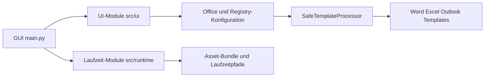
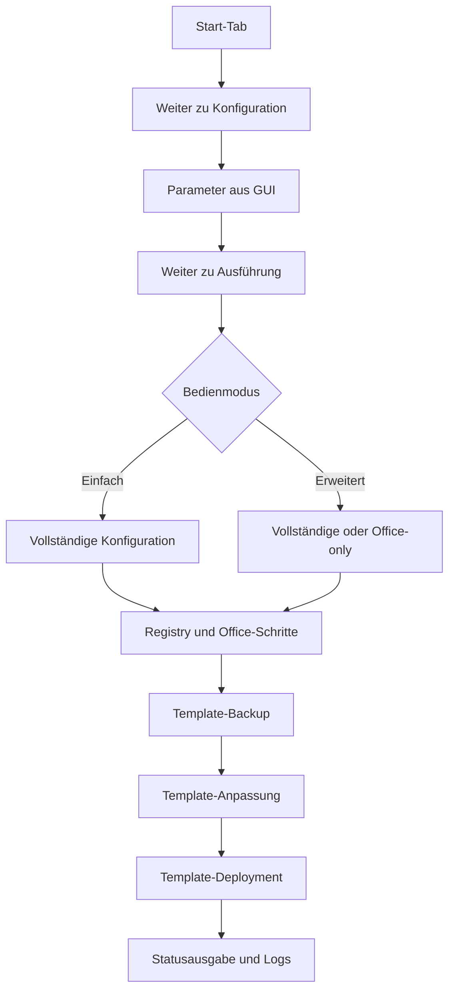

# DOKUMENTATION_TECHNIK

## 1. Architekturüberblick

`PC-Konfigurator` besteht aus folgenden Schichten:

- **GUI/Orchestrierung** (`src/main.py`)
- **Office-/System-Konfiguration** (mehrere Module im `src/`-Verzeichnis)
- **Template-Schutz** (`SafeTemplateProcessor`, ZIP-Integritätsprüfung)
- **Build/Release-Automation** (`setup.ps1`, `build.ps1`, `src/publish_release.ps1`)

Ziel ist eine robuste, portable Auslieferung als Windows-EXE (`onefile`) inklusive
externer Assets aus `data/` (`data/Fonts`, `data/Datei-Vorlagen`) und Dokumentation.




_Mermaid-Quelle: `docs/diagramme/technik_systemuebersicht.mmd`_

## 2. Wichtige Projektstruktur

```text
PC-Konfigurator/
├── src/                       # Python-Anwendung + Module
├── data/
│   ├── Fonts/                 # Schriftarten (familienweise strukturiert)
│   └── Datei-Vorlagen/        # Office-Vorlagen und Arbeitsdateien
├── docs/                      # Projektdokumentation
├── build.ps1                  # Build-Orchestrierung + Versionierung
├── setup.ps1                  # venv-Setup + Dependencies
├── src/publish_release.ps1    # Veröffentlichung von ZIP-Artefakten
├── src/PC-Konfigurator.spec
├── README.md
└── src/BUILD-INFO.txt
```

## 3. Laufzeitfluss

1. Start der EXE/`src/main.py`
2. Navigation `Start` → **Weiter** → `Konfiguration` → **Weiter** → `Ausführung`
3. Auswahl von Schriftart, Optionen und Zielparametern
4. Konfigurationspipeline:
   - Registry-Anpassungen (HKCU)   - Datei-Vorlagen zurücksetzen (nur wenn vom Anwender bestätigt aktiviert)
   - Datei-Vorlagen-Bibliothek synchronisieren (Update-Modus, läuft immer)   - Empfohlene Dateien/zuletzt verwendete Dateien/Sprunglisten deaktivieren
   - Explorer-Option „Immer Dateinamen und -inhalte suchen" aktivieren (`SearchFileNameAlways=1`)
   - Anwendungen im Startmenü standardmäßig als Liste darstellen
   - Office-Optimierungen
   - Edge- und Signatur-Backup wiederherstellen
   - Template-Anpassungen über SafeTemplateProcessor
   - Font-Installation und Zuweisung
   - Edge-Profile und E-Mail-Signaturen sichern/aktualisieren
   - Word-Einfügeoptionen per Registry und optional per COM synchronisieren
5. Ausführungsmodus:
   - `Einfach`: Vollständige Konfiguration
   - `Erweitert`: Vollständige Konfiguration oder Office-only
6. Logging und Ergebnisanzeige in der Oberfläche

Vor der Datei-Vorlagen-Synchronisation wird bei aktiviertem
`enable_office_preclose` ein Office-Preclose ausgeführt. Zusätzlich verhindert
`PCKonfiguratorGUI._execution_lock` parallele Konfigurationsläufe innerhalb
derselben Anwendung. Dadurch werden konkurrierende Zugriffe auf persönliche
Office-Dateien, insbesondere `Building Blocks.dotx`, vermieden.

### Building Blocks: benutzerbezogener manueller Editor

Die Word-Building-Blocks-Datei wird ausschließlich im Benutzerprofil gesucht:

`%APPDATA%\Microsoft\Document Building Blocks\<LCID>\<Office-Version>\Building Blocks.dotx`

Der Menüpunkt **Tools → Building Blocks manuell bearbeiten** ist unabhängig vom
Bedienmodus verfügbar. `run_manual_building_blocks_editor()` prüft zunächst die
Benutzerdatei, fragt die Aktion per Dialog ab, legt eine datierte Kopie unter
`_PC-Konfigurator-Backups` an und öffnet danach die Datei mit `os.startfile()`.
Es erfolgt dabei keine XML-Serialisierung und keine automatische inhaltliche
Änderung. Der vorhandene automatische Template-Flow bleibt davon getrennt:
`OfficeTemplateManager.update_building_blocks_template()` patcht eine vorhandene
Datei nur als optionalen Zusatzschritt bei der Office-Konfiguration.

Zusätzlich verwaltet `OfficeTemplateManager.sync_user_building_blocks_backup()`
die Sicherung unter
`Datei-Vorlagen\Sonstiges\Building Blocks\Building Blocks.dotx`. Die Routine
arbeitet nach dem „newest wins“-Prinzip: Eine neuere Benutzerdatei wird in die
Ablage kopiert; eine neuere Ablage-Datei wird vor dem manuellen Editor-Aufruf
ins persönliche `%APPDATA%`-Verzeichnis zurückgespielt. Fehlen beide Dateien,
wird der Schritt übersprungen. Das persönliche Backup ist optional: Kann die
Datei wegen eines vorübergehenden Dateisystemfehlers nicht gelesen werden, wird
dies als Warnung protokolliert und die übrige Vorlagen-/Office-Konfiguration
läuft weiter.

### Aktueller Status: offene Word-Detailpunkte

Die Word-Optionen „Jede Tabellenzeile mit einem Großbuchstaben beginnen" und
„Bilder einfügen" = „Mit Text in Zeile" sind inzwischen als Standardwerte in
der Office-Registry-Konfiguration des `PC-Konfigurator` hinterlegt.

Die Word-Schriftart- und Schriftgrößenanpassung ist auf die Absatzformatvorlagen
`Standard`/`Normal` und `Kein Leerraum`/`No Spacing` begrenzt. `docDefaults`,
Überschrift- und Titel-Formatvorlagen sowie die Word-Theme-Schrift werden nicht
global überschrieben.

Die vier Word-Einfügewerte werden als DWORD gesetzt: `0` für ursprüngliche
Formatierung innerhalb desselben Dokuments, `1` für Formatierung zusammenführen
zwischen Dokumenten, `3` für Zielformatvorlagen bei Formatvorlagenkonflikten und
`2` für Nur-Text aus anderen Programmen. Die verwendeten Werte erscheinen im
Registry-Detailfenster.




_Mermaid-Quelle: `docs/diagramme/technik_datenfluss.mmd`_

## 4. Build-Pipeline (lokal)

### 4.1 Setup

`setup.ps1` erstellt/aktualisiert die virtuelle Umgebung (`.venv`) und installiert Abhängigkeiten.

### 4.2 Build (`build.ps1`)

- Versionsverwaltung über `src/build_info.py`
- Optionaler Versionssprung (`-NoVersionBump` deaktiviert ihn)
- PyInstaller-Build (bevorzugt via `.spec`)
- Post-Build über `src/post_build.py`
- Optionales ZIP-Release (`-SkipZip` überspringt)

### 4.3 Post-Build (`src/post_build.py`)

Kopiert und validiert:

- `data/Fonts/`
- `data/Datei-Vorlagen/`
- `docs/`
- `README.md`
- `src/BUILD-INFO.txt`

Besonderheiten:

- fehlertolerantes Kopieren (OneDrive-Placeholder-resilient)
- Long-Path-Handling
- optionale Teilfreigabe bei Template-Lücken via `PCONFIG_ALLOW_PARTIAL_TEMPLATES=1`

Bei einem Release müssen lokal geänderte Dateien unter `data/Datei-Vorlagen/`
vor dem Commit geprüft und ausdrücklich mit veröffentlicht werden. Der
Release-Commit darf diese Vorlagen nicht stillschweigend auslassen; andere
unabhängige Arbeitsänderungen bleiben weiterhin ausgeschlossen.

### 4.4 Benutzerpfade und Edge-Backup

- `src/user_paths.py` liest `User Shell Folders\Personal` und berücksichtigt
   dadurch OneDrive-Umleitungen des Dokumente-Ordners.
- Ohne Umleitung wird `C:\Users\<Benutzer>\Dokumente` verwendet.
- `src/edge_profile_manager.py` verarbeitet Microsoft Edge unter
   `%LOCALAPPDATA%\Microsoft\Edge\User Data`.
- Outlook-Signaturen werden unter `%APPDATA%\Microsoft\Signatures` gelesen
   und separat in `Datei-Vorlagen\Sonstiges\E-Mail-Signaturen` abgelegt.
- Lokale Signaturen werden bei der Wiederherstellung nur ergänzt, wenn noch
   keine Signaturdateien vorhanden sind.
- Cache- und temporäre Edge-Daten werden nicht gesichert.

Bei einem Release müssen lokal geänderte Dateien unter `data/Datei-Vorlagen/`
vor dem Commit geprüft und ausdrücklich mit veröffentlicht werden. Der
Release-Commit darf diese Vorlagen nicht stillschweigend auslassen; andere
unabhängige Arbeitsänderungen bleiben weiterhin ausgeschlossen.

### 4.5 Datei-Vorlagen-Reset, -Synchronisation und Fehlerdiagnose

- `src/file_sync.py` (`FileSync`) stellt zwei Operationen bereit:
  - `sync_directories()` – Update-Modus (robocopy `/XO`/Python-Fallback),
    kopiert nur fehlende oder neuere Quelldateien, löscht nichts im Ziel.
    Läuft bei **jedem** Lauf (`_sync_file_templates` in `main.py`), damit die
    mitgelieferte Vorlagenbibliothek im Ziel `Datei-Vorlagen` immer vollständig ist.
  - `reset_directory_from_source()` – löscht das Ziel vollständig (`shutil.rmtree`)
    und ersetzt es 1:1 durch die Quelle (`shutil.copytree`). Wird nur ausgeführt,
    wenn der Anwender die Option „Datei-Vorlagen zurücksetzen“ im Konfiguration-Tab
    zuvor per Dialog bestätigt hat (`_reset_file_templates` in `main.py`); die
    Option wird nach dem Lauf automatisch wieder deaktiviert.
- `src/fs_retry.py` (`retry_on_oserror`) kapselt eine zentrale Retry-Logik für
  Dateisystem-Operationen: Bei `OSError` wird mit steigender Wartezeit (Start
  1,0 s, Faktor 1,3, Obergrenze 3,0 s, bis zu 12 Versuche → ca. 15–20 s Gesamt-
  wartezeit) wiederholt, bevor der Fehler weitergereicht wird. Grund: OneDrive
  kann während aktiver Synchronisierung neu angelegte Ordnerpfade kurzzeitig als
  nicht vorhanden melden (Platzhalter-/Reconciliation-Race). Verwendet von
  `edge_profile_manager.py` und `file_sync.py`.
- `sync_user_building_blocks_backup()` verwendet die Retry-Logik ebenfalls beim
   Kopieren der persönlichen `Building Blocks.dotx`. Nach ausgeschöpften
   Versuchen bleibt nur der optionale Backup-Teilschritt fehlgeschlagen; die
   eigentliche Datei-Vorlagen-Synchronisation wird nicht als Gesamtlauf markiert.
- `src/security_hints.py` (`describe_filesystem_error`) ergänzt `OSError`-Meldungen
  mit WinError 2/3/5 um einen Hinweis auf mögliche Blockaden durch den
  Kontrollierten Ordnerzugriff von Windows-Sicherheit oder andere Endpoint-/
  Antiviren-Richtlinien, ohne Sicherheitsmechanismen selbst zu umgehen.
- `src/edge_profile_manager.py` sichert Edge-Profile als ZIP-Archiv
  (`Sonstiges/Edge-Profile.zip`, `zipfile.ZIP_DEFLATED`) statt als unkomprimierten
  Ordner, da Profile durch IndexedDB/Extensions/Local Storage schnell mehrere
  hundert MB groß werden. `backup()` packt das Profil zunächst in ein temporäres
  Staging-Verzeichnis (`tempfile.mkdtemp`), zippt es atomar (`.pckconfig-tmp` +
  `os.replace`) und entfernt anschließend einen ggf. noch vorhandenen alten,
  unkomprimierten Backup-Ordner am selben Zielort. `restore()` entpackt das ZIP
  in ein temporäres Verzeichnis und kopiert von dort wie zuvor ins Live-Profil.
  E-Mail-Signaturen bleiben unkomprimiert (i. d. R. klein, unkritisch für den
  Speicherbedarf).

## 5. CI/CD und Releases

- Release-Artefakte liegen in `release/`
- Veröffentlichung über `src/publish_release.ps1`
- GitHub-Releases werden durch `.github/workflows/build-release.yml` bei einem
   Versions-Tag (`vX.Y.Z`) veröffentlicht.
- Der Workflow setzt den veröffentlichten Release standardmäßig mit
   `make_latest: true` als GitHub-„Latest“.
- Für einen Release muss daher nach dem geprüften Commit zusätzlich der passende
   Versions-Tag erstellt und nach GitHub gepusht werden.


_Mermaid-Quelle: `docs/diagramme/release_pipeline.mmd`_

## 6. Versionsmanagement

Single Source of Truth zur Build-Version:

- `src/build_info.py`

`build.ps1` synchronisiert daraus:

- `README.md`
- `docs/DOKUMENTATION_ANWENDER.md`
- `src/BUILD-INFO.txt`

## 7. Risiken und Randbedingungen

- OneDrive-Placeholder können Asset-Kopiervorgänge beeinträchtigen
- Office/COM-Verfügbarkeit kann je Client variieren
- Große Asset-Bestände beeinflussen Build- und ZIP-Zeit

## 8. Testempfehlungen

### Smoke-Test

1. Build ausführen (`build.ps1 -NoVersionBump`)
2. EXE starten
3. Konfiguration mit Standardwerten durchführen
4. Logausgabe auf Fehler/Warnungen prüfen
5. Prüfen, dass die Edge-/Signatur-Schritte im Laufstatus erscheinen
6. Bestätigungsdialog beim vollständigen Lauf mit „Nein“ und anschließend mit
   „Ja“ prüfen

### Behobene Fehler (v3.3.9)

**1. `startmenu_guard.py` – SyntaxError beim Modulimport (f-String GUID)**

Die GUID `{86ca1aa0-34aa-4e8b-a509-50c905bae2a2}` war in `_build_guard_ps1()`
direkt als Literal in einem f-String gesetzt. Python interpretierte `{86...}` als
Formatierungsausdruck und warf `SyntaxError: invalid decimal literal` bereits beim
Import, wodurch das gesamte Modul nicht geladen werden konnte. Kontextmenü-Klassik/
Modern-Wechsel und Autostart-Hinterlegung waren damit funktionslos.

**Fix:** Die Konstante `WIN11_CLASSIC_CONTEXTMENU_CLSID` wird jetzt per
`{WIN11_CLASSIC_CONTEXTMENU_CLSID}` in den f-String interpoliert.

**2. `main.py` – Explorer-Kill beim App-Start**

`_run_startmenu_guard()` wurde beim Kaltstart der App immer mit
`auto_restart_explorer=True` aufgerufen. Sobald der gespeicherte Modus nicht mit
dem aktuellen Registry-Stand übereinstimmte (z. B. frische ZIP-Installation ohne
vorhandene `gui_state.json`), wurde `taskkill /F /IM explorer.exe` ausgeführt. Das
destabilisierte die Shell und verhinderte einen sofortigen zweiten EXE-Start
(`Failed to load Python DLL`-Fehler aus `%TEMP%\_MEI...`).

**Fix:** `_run_startmenu_guard()` erhält einen Parameter `auto_restart_explorer`.
Beim Kaltstart wird `False` übergeben — der Autostart-Guard (Startup-Ordner) sorgt
beim nächsten Login für die Wirkung. Nur bei manueller GUI-Modus-Änderung wird
weiterhin `True` übergeben (sofortige sichtbare Wirkung gewünscht).

### Behobene Fehler (v3.3.19)

#### 1) Explorer-Neustart: Explorer-Prozess lief, Taskleiste blieb unsichtbar

In einzelnen Umgebungen war `explorer.exe` bereits wieder gestartet, die Shell war
jedoch noch nicht vollständig reinitialisiert (Taskleiste fehlte weiterhin).

**Fix:** Neustartlogik wurde auf Sichtbarkeitsprüfung der Taskleiste (`Shell_TrayWnd`)
umgestellt und um Recovery-Fallbacks erweitert (zusätzlicher Explorer-Start,
Shell-Komponenten-Reinit, `userinit.exe`-Fallback).

#### 2) Direktlauf-Warnung „Outlook-Vorlage nicht gefunden"

Bei Script-/Direktläufen konnte die Quellvorlage `NormalEmail.dotm` je nach
Runtime-Kontext fälschlich als fehlend gemeldet werden.

**Fix:** Robuste Kandidatenauflösung mit mehreren Basispfaden (Runtime-Root,
Projektwurzel, `cwd`) implementiert; Warnung tritt im validierten Direktlauf
nicht mehr auf.

### Sonder-Smoke-Check (31.05.2026): Explorer-/Startmenü-Registry

Durchgeführter Verifikationstest der neu ergänzten Windows-Registry-Werte
(`Hidden`, `Start_Layout`, `Start_TrackProgs`, `Start_TrackDocs`,
`Start_Show*`) auf dem Zielsystem:

- Systemstand: `Windows 10 Pro`, Build `26100.8524`
- Ergebnis Konfigurationslauf: `success = true`
- Vorher/Nachher-Vergleich der relevanten Explorer-Keys: stabil auf Zielwerten (`1`)
- Start-Zweig erkannt: `VisiblePlaces` ist vorhanden (build-spezifische Start-Ordnermatrix)
- Hinweis: `TaskbarDa` meldete lokal Zugriff verweigert, ist jedoch als optionaler Wert
   klassifiziert und blockiert den Lauf nicht

Damit ist die neue Registry-Logik für „Ausgeblendete Elemente anzeigen“ sowie die
Startmenü-Fallback-Werte technisch verifiziert.

### Behobene Fehler (v3.3.79–v3.3.84)

#### 1) Edge-/Signatur-Backup schlug unter OneDrive fehl (`WinError 2/3`)

Beim Anlegen von `Datei-Vorlagen\Sonstiges\Edge-Profile` bzw.
`...\E-Mail-Signaturen` trat sporadisch `FileNotFoundError` auf, wenn OneDrive
gerade aktiv synchronisierte (Platzhalter-/Reconciliation-Race). Ursprünglich
zu kurze Retry-Versuche (~1,2 s) reichten nicht aus.

**Fix:** Zentrales Retry-Modul `src/fs_retry.py` (`retry_on_oserror`) mit
steigender Wartezeit (bis ca. 15–20 s Gesamtwartezeit) in
`edge_profile_manager.py` und `file_sync.py` verwendet.

#### 2) Datei-Vorlagen-Zielordner blieb (fast) leer

Die mitgelieferte Vorlagenbibliothek (`data/Datei-Vorlagen`) wurde nie ins
Zielverzeichnis kopiert — nur die Registry (`PersonalTemplates`) zeigte
dorthin. Die dafür vorgesehene `FileSync`-Klasse war im Code vorhanden, aber
nicht in den Ablauf eingebunden.

**Fix:** Neuer Schritt „Datei-Vorlagen-Bibliothek synchronisieren“
(`_sync_file_templates` in `main.py`) läuft bei jedem Lauf im Update-Modus
(robocopy `/XO`, keine Löschung, keine Überschreibung neuerer Zieldateien).

#### 3) Fehlermeldungen ohne Diagnosehinweis

Fehler wie `WinError 2/3/5` beim Schreiben in geschützte Ordner (z. B. durch
den Kontrollierten Ordnerzugriff von Windows-Sicherheit) waren für Anwender
schwer einzuordnen.

**Fix:** Neues Modul `src/security_hints.py` (`describe_filesystem_error`)
ergänzt betroffene Fehlermeldungen um einen konkreten Hinweis, ohne
Sicherheitsmechanismen zu umgehen.

#### 4) Neue Option „Datei-Vorlagen zurücksetzen“

Ergänzt im Konfiguration-Tab, standardmäßig deaktiviert, mit
Bestätigungsdialog (Datenverlust-Hinweis) und automatischer Rücksetzung nach
dem Lauf. Nutzt `FileSync.reset_directory_from_source()`.

### Regression

- je eine Ausführung pro wichtiger Font-Familie
- Office-only und vollständige Konfiguration testen
- Template-Backup/Restore gezielt validieren
- OneDrive-Szenario mit teilweise offline Dateien prüfen
