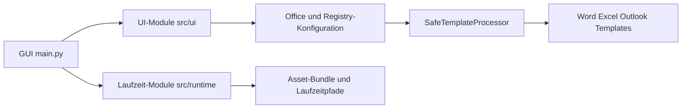
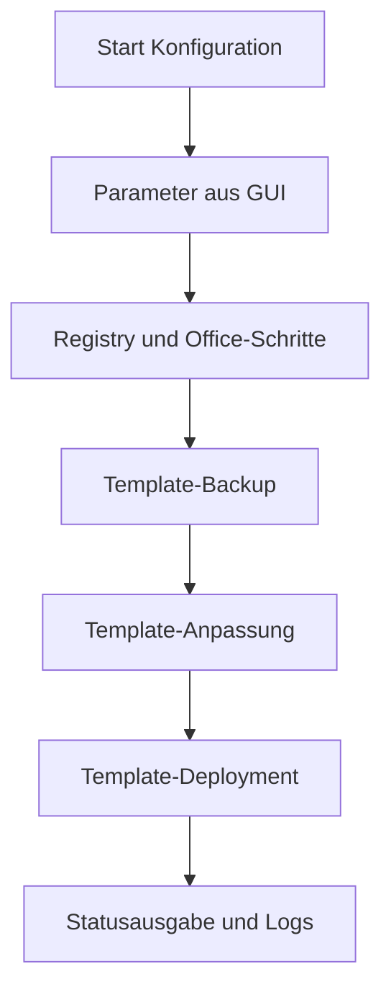
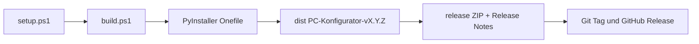

# DOKUMENTATION_TECHNIK

## 1. Architekturüberblick

`PC-Konfigurator` besteht aus folgenden Schichten:

- **GUI/Orchestrierung** (`src/main.py`)
- **Office-/System-Konfiguration** (mehrere Module im `src/`-Verzeichnis)
- **Template-Schutz** (`SafeTemplateProcessor`, ZIP-Integritätsprüfung)
- **Build/Release-Automation** (`setup.ps1`, `build.ps1`, `src/publish_release.ps1`)

Ziel ist eine robuste, portable Auslieferung als Windows-EXE (`onefile`) inklusive
externer Assets aus `data/` (`data/Fonts`, `data/Datei-Vorlagen`) und Dokumentation.




_Mermaid-Quelle: `docs/diagramme/technik_systemuebersicht.mmd`_

## 2. Wichtige Projektstruktur

```text
PC-Konfigurator/
├── src/                       # Python-Anwendung + Module
├── data/
│   ├── Fonts/                 # Schriftarten (familienweise strukturiert)
│   └── Datei-Vorlagen/        # Office-Vorlagen und Arbeitsdateien
├── docs/                      # Projektdokumentation
├── build.ps1                  # Build-Orchestrierung + Versionierung
├── setup.ps1                  # venv-Setup + Dependencies
├── src/publish_release.ps1    # Veröffentlichung von ZIP-Artefakten
├── src/PC-Konfigurator.spec
├── README.md
└── src/BUILD-INFO.txt
```

## 3. Laufzeitfluss

1. Start der EXE/`src/main.py`
2. Auswahl von Schriftart, Optionen und Zielparametern
3. Konfigurationspipeline:
   - Registry-Anpassungen (HKCU)
   - Office-Optimierungen
   - Template-Anpassungen über SafeTemplateProcessor
   - Font-Installation und Zuweisung
4. Logging und Ergebnisanzeige in der Oberfläche




_Mermaid-Quelle: `docs/diagramme/technik_datenfluss.mmd`_

## 4. Build-Pipeline (lokal)

### 4.1 Setup

`setup.ps1` erstellt/aktualisiert virtuelle Umgebungen (`.venv` oder `.venv-bfw`) und installiert Abhängigkeiten.

### 4.2 Build (`build.ps1`)

- Versionsverwaltung über `src/build_info.py`
- Optionaler Versionssprung (`-NoVersionBump` deaktiviert ihn)
- PyInstaller-Build (bevorzugt via `.spec`)
- Post-Build über `src/post_build.py`
- Optionales ZIP-Release (`-SkipZip` überspringt)

### 4.3 Post-Build (`src/post_build.py`)

Kopiert und validiert:

- `data/Fonts/`
- `data/Datei-Vorlagen/`
- `docs/`
- `README.md`
- `src/BUILD-INFO.txt`

Besonderheiten:

- fehlertolerantes Kopieren (OneDrive-Placeholder-resilient)
- Long-Path-Handling
- optionale Teilfreigabe bei Template-Lücken via `PCONFIG_ALLOW_PARTIAL_TEMPLATES=1`

## 5. CI/CD und Releases

- Release-Artefakte liegen in `release/`
- Veröffentlichung über `src/publish_release.ps1`
- GitHub-Release-Integration ist über Repo-Workflow möglich (je nach Projektstand)




_Mermaid-Quelle: `docs/diagramme/release_pipeline.mmd`_

## 6. Versionsmanagement

Single Source of Truth zur Build-Version:

- `src/build_info.py`

`build.ps1` synchronisiert daraus:

- `README.md`
- `docs/DOKUMENTATION_ANWENDER.md`
- `src/BUILD-INFO.txt`

## 7. Risiken und Randbedingungen

- OneDrive-Placeholder können Asset-Kopiervorgänge beeinträchtigen
- Office/COM-Verfügbarkeit kann je Client variieren
- Große Asset-Bestände beeinflussen Build- und ZIP-Zeit

## 8. Testempfehlungen

### Smoke-Test

1. Build ausführen (`build.ps1 -NoVersionBump`)
2. EXE starten
3. Konfiguration mit Standardwerten durchführen
4. Logausgabe auf Fehler/Warnungen prüfen

### Sonder-Smoke-Check (31.05.2026): Explorer-/Startmenü-Registry

Durchgeführter Verifikationstest der neu ergänzten Windows-Registry-Werte
(`Hidden`, `Start_Layout`, `Start_TrackProgs`, `Start_TrackDocs`,
`Start_Show*`) auf dem Zielsystem:

- Systemstand: `Windows 10 Pro`, Build `26100.8524`
- Ergebnis Konfigurationslauf: `success = true`
- Vorher/Nachher-Vergleich der relevanten Explorer-Keys: stabil auf Zielwerten (`1`)
- Start-Zweig erkannt: `VisiblePlaces` ist vorhanden (build-spezifische Start-Ordnermatrix)
- Hinweis: `TaskbarDa` meldete lokal Zugriff verweigert, ist jedoch als optionaler Wert
   klassifiziert und blockiert den Lauf nicht

Damit ist die neue Registry-Logik für „Ausgeblendete Elemente anzeigen“ sowie die
Startmenü-Fallback-Werte technisch verifiziert.

### Regression

- je eine Ausführung pro wichtiger Font-Familie
- Office-only und vollständige Konfiguration testen
- Template-Backup/Restore gezielt validieren
- OneDrive-Szenario mit teilweise offline Dateien prüfen
